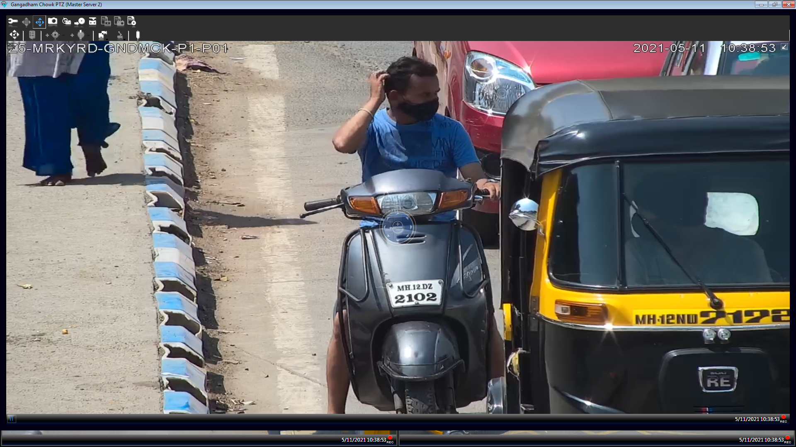
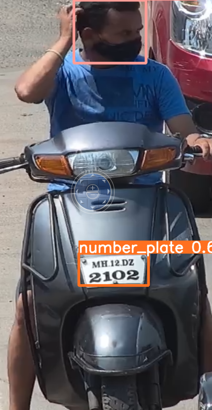
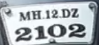

 ## Automatic License Plate-Recognition of Bikers with No Helmets

Motorcycles have always been the primary mode of transport in developing countries. In recent years, there has been a rise in motorcycle accidents. One of the major reasons for fatalities in accidents is the motorcyclist not wearing a protective helmet. The most prevalent method for ensuring that motorcyclists wear helmet is traffic police manually monitoring motorcyclists at road junctions or through CCTV footage and penalizing those without helmet.

## Tech Stack:

## Sample Demo:

**Image from the CCTV Camera:**

 

**Vehicle Detected by the First Stage YOLO:**

 
 
**Number Plate and Helmet/No Helmet Detected by Second Stage YOLO:**

 

**Number Plate Cropped Automatically:**
 
 
 
 
**The Number Plate is Detected using OCR using the Google Cloud Vision/ Tessaract:**
 
 **Detected : MH 12 DZ 2102**
 

